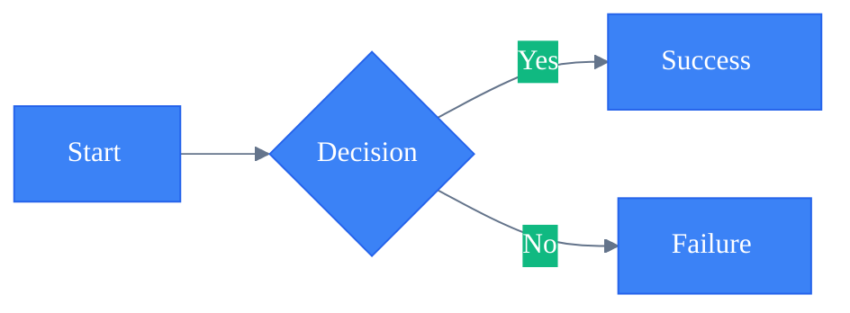
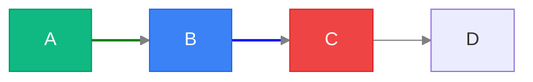
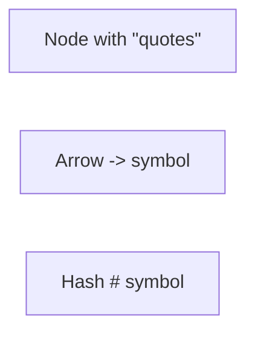
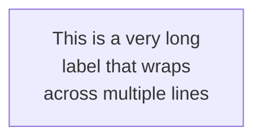

# Advanced Configuration & Styling

Configuration, theming, custom styling, troubleshooting, and export for Mermaid diagrams.

## Init Directive



Frontmatter alternative:

```yaml
---
title: My Diagram
config:
  theme: forest
  flowchart:
    defaultRenderer: elk
---
```

## Theme Variables

Themes: `default`, `dark`, `forest`, `neutral`, `base`

**Core:** `primaryColor`, `primaryTextColor`, `primaryBorderColor`, `secondaryColor`, `tertiaryColor`, `lineColor`, `textColor`, `background`, `fontSize`, `fontFamily`

**Diagram-specific:**
- **Flowchart:** `nodeBorder`, `nodeTextColor`, `clusterBkg`, `clusterBorder`, `edgeLabelBackground`
- **Sequence:** `actorBorder`, `actorBkg`, `actorTextColor`, `activationBorderColor`, `signalColor`, `noteBkgColor`, `noteTextColor`
- **State:** `labelColor`, `altBackground`
- **Gantt:** `gridColor`, `todayLineColor`, `taskTextColor`, `doneTaskBkgColor`, `critBkgColor`

## Class-Based Styling


## Individual Node & Link Styling



Properties: `fill`, `stroke`, `stroke-width`, `stroke-dasharray`, `color`, `font-weight`

## Layout & Directives

**ELK Renderer (v9.4+):** Better complex layouts, predictable edge routing, improved subgraph positioning.

```javascript
%%{init: {
  'theme': 'default',
  'flowchart': { 'defaultRenderer': 'elk', 'curve': 'basis', 'padding': 15 },
  'sequence': { 'showSequenceNumbers': true, 'actorMargin': 50 },
  'gantt':    { 'barHeight': 20, 'fontSize': 11, 'sectionFontSize': 14 }
}}%%
```

Directive keys: `flowchart`, `sequenceDiagram`, `classDiagram`, `stateDiagram`, `erDiagram`, `gantt`

## Security Levels

| Level | Description |
|-------|-------------|
| `strict` | Most secure, no HTML/JS |
| `loose` | Allows some interaction |
| `antiscript` | Allows HTML, blocks scripts |
| `sandbox` | iframe sandbox |

Use `%%{init: { 'securityLevel': 'loose' }}%%` to enable `click A href "..." _blank`.

## Troubleshooting

**Special characters** — escape with HTML entities or quoted strings:



**Long labels** — use backtick multiline strings:



**Arrow syntax by diagram type:**

| Diagram | Sync | Async | Dotted |
|---------|------|-------|--------|
| Flowchart | `-->` | N/A | `-.->` |
| Sequence | `->>` | `-->>` | `-->>` |
| Class | `-->` | N/A | `..>` |
| State | `-->` | N/A | N/A |

**Debugging:** Verify diagram type declaration; check unclosed brackets/quotes; match arrow syntax to type. Start minimal, add elements one at a time. Live editor: https://mermaid.live

## Accessibility & Performance

**Accessibility:** Provide context text before diagrams. HTML: `<div class="mermaid" role="img" aria-label="...">`.

**Performance:** Split large diagrams. Use ELK for complex layouts. Prefer class-based over inline styling. Cache renders; lazy load in docs.

## Export

| Method | Command/Usage |
|--------|--------------|
| Live editor | PNG, SVG, Markdown at https://mermaid.live |
| Programmatic | `const svg = await mermaid.render('id', diagramText)` |
| CLI | `npx @mermaid-js/mermaid-cli -i input.md -o output.svg` |
